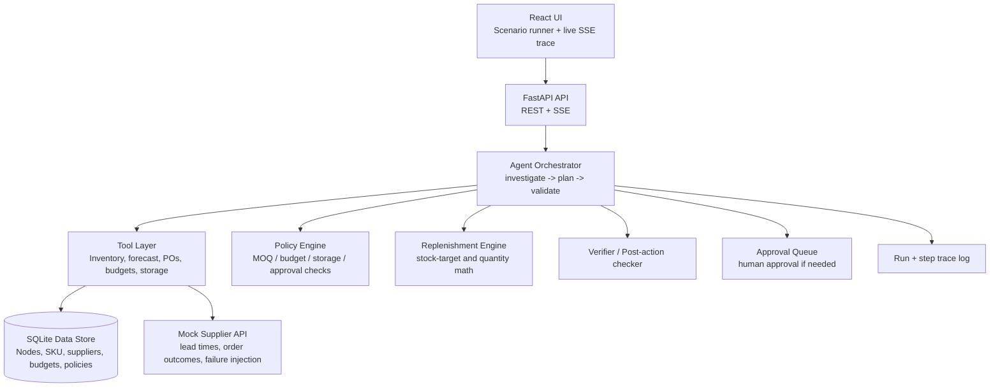

# AI Purchasing Agent

Autonomous purchasing agent for retail and quick-commerce fulfillment: investigate → decide → act → validate → recover. The system reads live inventory, demand, supplier terms, and policy constraints; the LLM proposes a purchase strategy; deterministic code evaluates the recommendation against replenishment math, business rules, and policy guardrails before any action is accepted. When the risk is high or the approval threshold is crossed, the workflow pauses for live human signoff instead of acting blindly.

This repo implements a working demo of that architecture: a Python/FastAPI backend, a React + Vite dashboard, a deterministic policy engine, and a mock supplier/fulfillment model that can run completely offline with no API key.

## UI preview


> Recorded demo / GIF placeholder: https://example.com/demo.gif

---

## 1) Problem understanding & assumptions

This project addresses a familiar operations problem in retail supply: inventory at a fulfillment node is often too low or too high because demand, lead time, open POs, and supplier performance create a noisy decision environment. A buyer must decide whether to:

- accept current demand and do nothing,
- place a purchase order,
- modify an existing order,
- reject the recommendation,
- or escalate for manual review.

The system assumes:

- Retail inventory is distributed across multiple fulfillment nodes.
- Each node has inventory, storage capacity, forecasted demand, and open POs.
- Each supplier has lead time, MOQ, order multiple, fill-rate, and pricing terms.
- The business has a budget and a storage limit for each node.
- A “good” procurement agent should not act on a model proposal without code-based verification.
- Demo mode runs with mock data and no external API key; production mode can swap in real LLM providers and ERP data sources.

Core assumptions in the current repo:

- Default provider is mock mode: `LLM_PROVIDER=mock`.
- SQLite is the local default data store for rapid local testing.
- Currency is USD.
- Service level target is 95% unless overridden by policy data.
- Product facts, suppliers, budgets, and nodes are seeded locally.

---

## 2) Architecture diagram + component explanation



### Component explanation

- Frontend: React + Vite dashboard for scenario selection, live decision cards, and SSE trace events.
- FastAPI backend: exposes scenario APIs, run APIs, SSE stream, and admin/utility routes.
- Orchestrator: the decision loop runner. It gathers data, asks the model for a proposal, runs code-based validation, and persists the run.
- Tool layer: all business facts are accessed through typed tool functions rather than direct database access.
- Policy engine: enforces business guardrails such as supplier MOQ, order-multiple constraints, budget limits, storage limits, and approval thresholds.
- Replenishment engine: computes the mathematically justifiable reorder quantity given on-hand stock, inbound stock, coverage horizon, and service target.
- Supplier API layer: simulates failure conditions (partial delivery, delays, or supplier rejection) in offline mode.
- Verifier: checks whether the final action is valid after the decision step.
- Approval queue: routes high-risk decisions to a human before execution.

---

## 3) Approach

The system is built around a disciplined decision loop:

1. Investigate: collect the facts from inventory, demand, suppliers, and open POs.
2. Decide: let the LLM propose a candidate action using only the observed evidence.
3. Validate: run deterministic code to check whether the proposal violates policy or math rules.
4. Act: if approved, create or adjust a purchase order or decide not to act.
5. Verify: confirm the post-action state is still safe and within guardrails.
6. Recover: if a failure occurs, adjust the plan, escalate, or request approval.

### Why “LLM proposes / code disposes”

This pattern is important because it keeps the system both powerful and controllable.

- The LLM is good at reasoning over messy, partial, or contradictory business signals.
- Deterministic code is good at enforcing constraints and math fidelity.
- A model can propose a quantity, but only code should decide whether it violates MOQ, budget, storage, or risk thresholds.

This avoids “hallucinated purchasing behavior” and ensures every action remains explainable.

### Tool design

The tool layer is intentionally narrow and typed. Examples from this repo include:

- `get_inventory()`
- `get_demand_forecast()`
- `get_open_purchase_orders()`
- `get_budget()`
- `get_storage_capacity()`
- `get_supplier_terms()`
- `list_alternate_suppliers()`
- `compute_replenishment_tool()`
- `create_purchase_order()`
- `request_human_approval()`

These functions hide database and business logic behind a consistent interface and make the agent run safer and easier to reason about.

### Agent loop

The orchestrator repeatedly walks this flow:

- gather checks
- build a scenario context
- call the provider to create a plan
- run validation checks
- persist the run and steps
- return final decision and trace

The architecture intentionally separates observation, decision, validation, and action persistence so each event can be inspected later.

### Uncertainty handling

The system recognizes when evidence is incomplete:

- stale forecast → investigate further
- missing supply data → escalate or request approval
- ambiguous supplier state → prefer conservative action
- risk threshold exceeded → require human signoff

This keeps the agent from acting confidently on weak evidence.

---

## 4) Scenario walkthroughs

The repository includes scenario families that exercise different purchase states. The most important ones are S1–S4 pattern groups.

### Scenario family S1: standard demand / fulfillment scenarios

| Scenario | Facts needed | Tools | Decision logic | Action | Validation |
|---|---|---|---|---|---|
| S1-A Accept | on-hand inventory, forecast, open POs, budget | inventory, forecast, open_pos, budget | demand is covered and no policy breach | no new PO | confirm stock remains above safety coverage |
| S1-B Modify over-order | on-hand, open POs, supplier MOQ, existing order quantity | inventory, open_pos, supplier_terms | over-order is detected and should be reduced | adjust or cancel excess order | verify revised qty respects MOQ + budget |
| S1-C Modify storage | remaining capacity, unit volume, forecast use | storage_capacity, replenishment math | storage risk exceeds free space | reduce reorder or split shipment | check free_m3 and volume_m3 constraints |
| S1-D Modify budget | remaining budget, unit cost, planned qty | budget, supplier_terms, replenishment math | intended order exceeds budget | scale order down | verify unit-cost × qty within threshold |
| S1-E Reject | incoming stock already covers demand horizon | inventory, forecast, open_pos | nothing needed; reject purchase | no action | final state remains valid |
| S1-F Investigate | stale forecast and uncertain demand signal | forecast, sales_history, open_pos | evidence is weak or stale | request human check / backfill | confirm uncertainty status before action |

### Scenario family S2: recovery / supplier resilience

| Scenario | Facts needed | Tools | Decision logic | Action | Validation |
|---|---|---|---|---|---|
| S2-A Partial supplier recovery | partial shipment, fill-rate, ETA, open order | supplier_terms, open_pos | accept partial delivery and place no additional order | no further PO or smaller rebalance | verify remaining risk and ETA |
| S2-B Alternate supplier | primary lead time risk, alternate supplier price/capacity | list_alternate_suppliers, supplier_terms | switch to lower-risk source | propose alternate supplier PO | compare total cost and fill rate before approval |
| S2-C Escalate | all options fail or risk high | supplier_terms, budget, policy engine | no safe action with current data | human approval or escalation | require explicit decision record |

### Scenario family S3: budget + storage pressure

These scenarios test policy guardrails when real-world limits are tight.

| Scenario | Facts needed | Tools | Decision logic | Action | Validation |
|---|---|---|---|---|---|
| S3-A Storage pressure | current usage, free_m3, unit volume | storage_capacity, product metadata | order would exceed storage | approve lower qty or split shipment | ensure volume <= free_m3 |
| S3-B Budget pressure | remaining budget, committed spend | budget, replenishment calc | max spend is reached | cap quantity | maintain budget safety margin |

### Scenario family S4: validation and human approval

| Scenario | Facts needed | Tools | Decision logic | Action | Validation |
|---|---|---|---|---|---|
| S4-A Threshold approval | order value near or above threshold | policy engine, budget | approval required | route to human | no execution until approving decision |
| S4-B Invalid policy plan | MOQ/order multiple mismatch | policy engine | rule violation blocks action | revise quantity | confirm repaired state |

---

## 5) How decisions are validated

This project uses a three-layer feedback loop.

### Layer 1: Data and math validation

Before the model can move forward, the system checks the raw facts.

- inventory coverage
- demand forecast quality
- open PO status
- budget remaining
- storage availability
- current supplier terms

This is where `compute_replenishment()` and the tool layer matter most.

### Layer 2: Policy validation

The policy engine checks:

- supplier status is active
- MOQ is respected
- order multiple is respected
- storage volume fits free capacity
- budget and approval thresholds are not exceeded
- max quantity and safety constraints are valid

If this layer fails, the system reduces quantity or rejects the action.

### Layer 3: Post-action verification

After a recommended action is created or modified, the system verifies that the final state remains safe.

- Does the order still respect constraints?
- Is the node still within storage and budget budgets?
- Did the decision change the risk profile?
- Does the event remain explainable and auditable?

This final layer reduces “model drift” and forces a deterministic final check before presenting the result.

### Failure matrix

| Failure mode | Trigger | Recovery action |
|---|---|---|
| Supplier blocked | supplier status = blocked | reject or escalate |
| MOQ violation | qty < MOQ | increase to MOQ or revise supplier |
| Order multiple violation | qty not multiple of rule | round up / revise recommendation |
| Storage violation | volume > free storage | reduce qty or split PO |
| Budget violation | projected spend > capacity | reduce qty or request approval |
| Forecast stale | model accuracy weak or age older than threshold | investigate / escalate |
| Approval threshold exceeded | spend crosses approved limit | route to human approval |
| Partial supplier failure | supplier fill-rate or ETA risk | alternate supplier or partial reorder plan |

---

## 6) Evaluation approach, test scenarios, results table, limitations

The evaluation harness is in `evals/run.py` and `evals/scoring.py`.

### Evaluation goals

- ensure downstream scenario decisions are consistent
- validate that each scenario family returns a complete decision
- confirm the system handles edge cases without crashing
- measure whether the agent chooses correct high-level outcomes

### Test scenarios

The repo evaluates a mix of scenario IDs such as:

- S1-A
- S1-B
- S1-C
- S1-D
- S1-E
- S1-F
- S2-A
- S2-B
- S4-D

These scenarios cover:

- standard accept / reject cases
- over-order reduction
- storage pressure
- budget pressure
- investigator states
- supplier recovery and escalation states

### Results table

| Scenario | Decision | Status |
|---|---|---|
| S1-A | ACCEPT | completed |
| S1-B | MODIFY | completed |
| S1-C | ACCEPT | completed |
| S1-D | ACCEPT | completed |
| S1-E | REJECT | completed |
| S1-F | INVESTIGATE_FURTHER | completed |
| S2-A | ACCEPT | completed |
| S2-B | ACCEPT | completed |
| S4-D | ACCEPT | completed |

The current project record demonstrates successful live evaluation in the repository’s harness.

### Limitations

- This is a deterministic mock environment, not a live ERP system.
- LLM behavior is intentionally constrained by code-level policy checks.
- Evaluation is scenario-based rather than a full production-grade procurement benchmark.
- Full real-world integration with ERP, finance, and warehouse events would require more data contracts, observability, and governance.

---

## 7) Setup & run

### Prerequisites

- Python 3.11+
- Node.js 18+
- npm
- Docker (optional)

### Local environment

From the repo root:

```bash
cp .env.example .env
make setup
make seed
make run
```

This will:

- create the backend virtual environment,
- install Python dependencies,
- install frontend dependencies,
- create the SQLite data file,
- seed the database,
- run the backend and frontend together.

### Run without API keys

This repo is designed to run in mock mode without an external LLM key.

```env
LLM_PROVIDER=mock
```

No key is required for the default demo mode.

### Backend

```bash
cd backend
source .venv/bin/activate
uvicorn app.main:app --host 0.0.0.0 --port 8000 --reload
```

### Frontend

```bash
cd frontend
npm install
npm run dev -- --host 0.0.0.0
```

### App URLs

- Frontend: http://localhost:5173
- Backend API: http://localhost:8000
- Swagger docs: http://localhost:8000/docs
- Health endpoint: http://localhost:8000/healthz

### Docker option

```bash
docker compose up --build
```

Then open:

- http://localhost:5173
- http://localhost:8000/docs

### Running tests and evals

```bash
make test
make eval
```

Or directly:

```bash
cd backend && ../backend/.venv/bin/python -m pytest tests/ -v
```

and

```bash
PYTHONPATH=backend:. python -m evals.run
```

---

## 8) Working demo instructions + demo script

### Working demo instructions

1. Start the app with `make run`.
2. Open the frontend at http://localhost:5173.
3. Select a scenario family such as S1-A, S1-B, or S1-F.
4. Click Run Agent.
5. Observe the live decision card and trace stream.
6. Check that the decision and trace update as the backend processes a real run.

### Demo script

> “The agent begins by collecting the numerical facts from the node: current inventory, open POs, forecast accuracy, and storage/budget headroom. It then proposes a recommendation, but the system does not blindly execute it. The enforcement engine checks MOQ, order multiple, budget, and storage constraints before accepting the recommendation. If the action crosses the approval threshold or the evidence is weak, the workflow pauses and asks for human review.”

> “In this scenario, the policy layer spots that the proposed purchase would exceed budget or violate storage. The model is allowed to propose, but the code enforces the business rule. The run is persisted with a recorded trace so the decision is explainable and auditable.”

> Recorded presentation or GIF placeholder: https://example.com/demo.gif

---

## 9) Human-approval policy table and guardrails

| Condition | Trigger | Action |
|---|---|---|
| High-value purchase | `unit_price * qty > auto_approve_limit` | route to human approval |
| Supplier blocked | supplier status blocked | block action and escalate |
| Forecast stale | model accuracy poor or data stale | investigate or request approval |
| Volume exceeds capacity | storage requirement > free space | reduce quantity or split order |
| Weak evidence / contradictory data | multiple signals disagree | ask for human review |
| Supplier mismatch | partner is not active or missing policy coverage | reject or re-plan |

### Guardrails

- No action is executed without validation.
- Any decision that crosses the approval threshold requires a human signoff.
- The agent records what was observed, what was proposed, and what was validated.
- All runs are persisted for auditability.
- In mock mode, supplier chaos can be explicitly enabled for demo testing, but it is never silently ignored.

---

## 10) Optional extras implemented

The project includes a few useful extras beyond the baseline workflow:

- live agent trace streaming via SSE
- deterministic scenario seed data for multi-node retail contexts
- mock supplier behaviors for offline demo scenarios
- evaluation harness for repeatable scenario testing
- React dashboard with scenario selection and decision card
- Docker-based local run option
- SQLite-backed trace and order persistence

---

## 11) Future improvements & production considerations

### Near-term improvements

- real ERP / WMS integration
- stronger supplier SLA and fulfilment event ingestion
- richer forecasting model with confidence intervals
- better UI for approvals, audit trails, and exception queues

### Production considerations

- replace SQLite with PostgreSQL or cloud-managed database
- add structured logs and tracing with OpenTelemetry
- add RBAC for approvers, operators, and administrators
- add cost controls and model usage budget guardrails
- secure secrets via environment variables or vaults
- define explicit SLA and alerting for delayed supplier responses
- add monitoring for model or tool failures and policy violations

---

## 12) Security note

This repo must never commit secrets.

- Keep `.env` local only.
- Use `.env.example` as a non-secret reference.
- Do not store API keys in Git history or in public repos.
- Only environment variables or secret stores should carry production credentials.

The default offline mode is intentionally safe because it does not require external API keys.

---

## Summary

This project is a working blueprint for an operational AI purchasing assistant that is safe, explainable, and auditable. It is designed to help a retail or quick-commerce business move from ad hoc buying to controlled, policy-aware decisioning without sacrificing the strengths of LLM reasoning.

If you want to run it locally, start with:

```bash
cp .env.example .env
make setup
make seed
make run
```

Then open the frontend and trigger the agent against a scenario.
